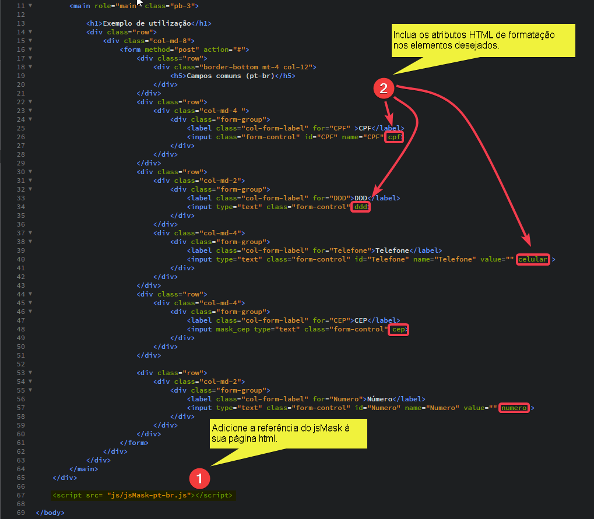

# javascriptMask (jsMask)

## O que é?
Criado para ser leve e funcional, o javascriptMask é simplesmente um script (100% javascript) que proporcionará aos seus formulários a funcionalidade de máscara de edição (incluindo os caracteres especiais conforme o usuário digita e impedindo a digitação de caracteres inválidos).

Atualmente atendemos os seguintes formatos (Pt-br):
  * CPF
  * CNPJ
  * DDD
  * Telefone 
  * Celular (com e sem o nono dígito - reconhecido e incluído automaticamente)
  * Número 
   

 ## Por que utilizar?
  * Um único script, pronto e testado.
  * Com a participação da comunidade, teremos cada vez mais formatos e melhorias.
  * Leve
  
  ## Como utilizar
  São dois passos:
  1. Referencie o script jsMask na sua página
  2. Inclua as tags de formatação.
  
  
  ## Contribuir com o projeto.
  Não deixe de contribuir com o projeto com novos formatos, melhorias, refatoração, qualquer contribuição é bem vinda para juntos melhorarmos esse projeto e criarmos um script útil para todos nós.
